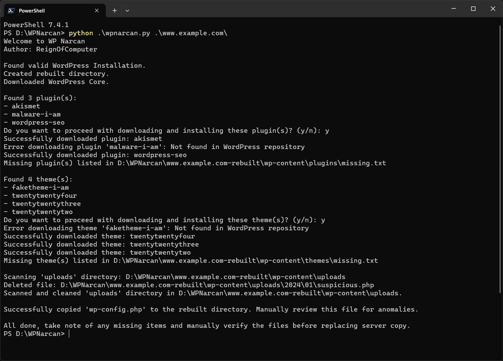

# WP Narcan



WP Narcan is a Python-based tool designed to assist in the recovery of WordPress sites that have been compromised by malware. In an era where online security threats are rampant, and WordPress sites are a common target, WP Narcan provides a straightforward, offline solution to rebuild a post-hack WordPress installation, ensuring a clean slate free from malware.

## Features

- Validates the presence of a WordPress installation.
- Rebuilds the WordPress directory with the latest WordPress core files.
- Handles plugins and themes by attempting to download clean versions from the official WordPress repository.
- **Local repo support** — supply directories of zip files for paid/custom plugins and themes that aren't available on WordPress.org. Local zips are tried first, with automatic fallback to the online repository.
- Scans and cleans the `uploads` directory, removing potentially malicious scripts (`.php`, `.phtml`, `.phar`, `.exe`, `.sh`, `.htaccess`, `.user.ini`, and more).
- Handles **mu-plugins** — copies them from the original installation and scans each file for suspicious patterns, since mu-plugins auto-load and are a common malware hiding spot.
- Scans **drop-in files** (`advanced-cache.php`, `db.php`, `object-cache.php`, etc.) for suspicious patterns and flags unexpected PHP files in the `wp-content/` root.
- Scans `wp-config.php` for suspicious patterns (e.g. `eval()`, `base64_decode()`, shell commands) before copying it to the rebuilt directory.
- Supports custom `wp-content` directory names via `--wp-content-dir` for non-standard WordPress installations.
- Preserves "Silence is golden" index.php files and allows for manual verification of files before replacing them on the server.
- Produces a recovery summary report and saves a detailed log to `wpnarcan.log`.

## Usage

To use WP Narcan, ensure you have Python installed on your system and follow these steps:

1. Clone or download the WP Narcan repository to your local machine.
2. Install dependencies: `pip install -r requirements.txt`
3. Open a terminal or command prompt.
4. Navigate to the WP Narcan directory.
5. Run the script by executing `python wpnarcan.py <path_to_your_wordpress_directory>`.
6. Follow the on-screen prompts to rebuild your WordPress site.

### Local Repos for Paid/Custom Plugins and Themes

If you have paid or custom plugins/themes that are not available on the WordPress.org repository, you can provide local directories containing their zip files. WP Narcan will check the local repo first and only fall back to WordPress.org if the zip is not found locally.

**Each zip file must be named to match the plugin/theme folder name.** For example, if your site has a plugin installed at `wp-content/plugins/my-premium-plugin/`, the local repo must contain `my-premium-plugin.zip`.

```
python wpnarcan.py /path/to/hacked-site \
    --local-repo-plugins /path/to/plugin-zips \
    --local-repo-themes /path/to/theme-zips
```

You can use one or both flags. Any plugin or theme not found in the local repo will still be attempted from WordPress.org before being marked as missing.

### Custom wp-content Directory

If your WordPress installation uses a renamed `wp-content` directory (set via `WP_CONTENT_DIR` in wp-config.php), use the `--wp-content-dir` flag:

```
python wpnarcan.py /path/to/hacked-site --wp-content-dir app
```

This tells WP Narcan to look for plugins, themes, uploads, mu-plugins, and drop-ins under `app/` instead of the default `wp-content/`.

## License

WP Narcan is licensed under the MIT License. See the LICENSE file in the project repository for more information.

## Support

If you require assistance with recovering a WordPress site compromised by malware, I am available for hire. Contact me on Twitter: [@ReignOfComputer](https://twitter.com/ReignOfComputer).

## Donations

Your support is appreciated. If you find WP Narcan helpful, consider making a donation to support the project:

BTC Wallet Address: `bc1q76vc0emvwv9xkv34mydfaa9lme2unc9g07su9x`

Thank you for your support!

