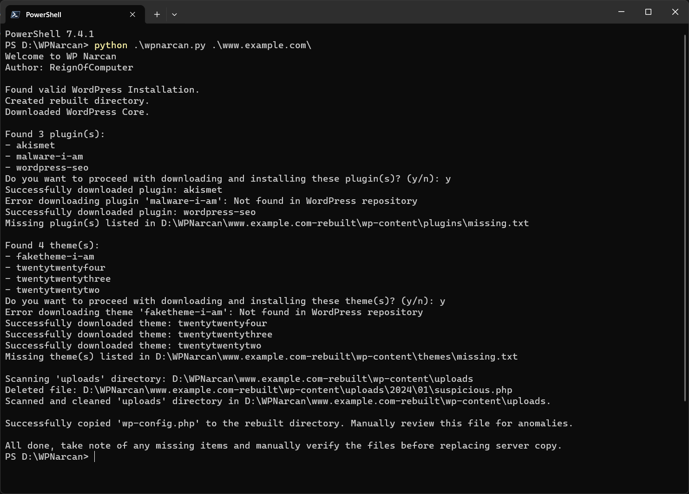

# WP Narcan

WP Narcan is a Python-based tool designed to assist in the recovery of WordPress sites that have been compromised by malware. In an era where online security threats are rampant, and WordPress sites are a common target, WP Narcan provides a straightforward, offline solution to rebuild a post-hack WordPress installation, ensuring a clean slate free from malware.

## Features

- Validates the presence of a WordPress installation.
- Rebuilds the WordPress directory with the latest WordPress core files.
- Handles plugins and themes by attempting to download clean versions from the official WordPress repository.
- Scans and cleans the `uploads` directory, removing potentially malicious `.php` files and other suspicious scripts.
- Preserves "Silence is golden" index.php files and allows for manual verification of files before replacing them on the server.

## Usage

To use WP Narcan, ensure you have Python installed on your system and follow these steps:

1. Clone or download the WP Narcan repository to your local machine.
2. Open a terminal or command prompt.
3. Navigate to the WP Narcan directory.
4. Run the script by executing `python narcan.py <path_to_your_wordpress_directory>`.
5. Follow the on-screen prompts to rebuild your WordPress site.

## License

WP Narcan is licensed under the MIT License. See the LICENSE file in the project repository for more information.

## Support

If you require assistance with recovering a WordPress site compromised by malware, I am available for hire. Contact me on X: [@ReignOfComputer](https://twitter.com/ReignOfComputer).

## Donations

Your support is appreciated. If you find WP Narcan helpful, consider making a donation to support the project:

BTC Wallet Address: `bc1q76vc0emvwv9xkv34mydfaa9lme2unc9g07su9x`

Thank you for your support!

